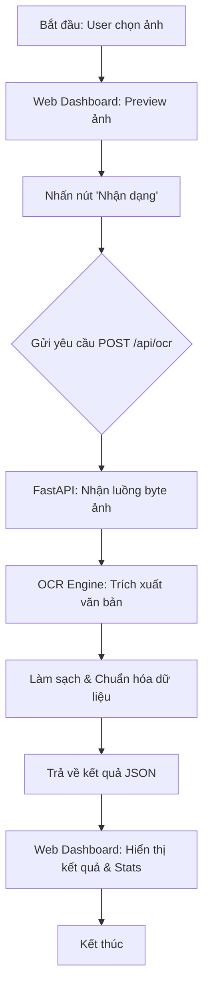
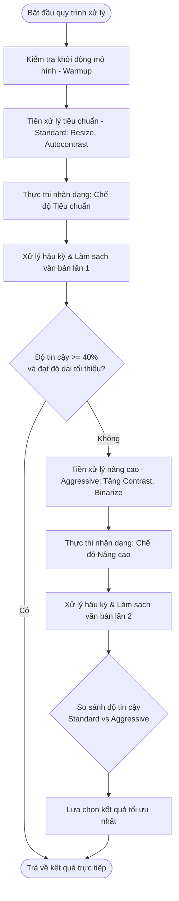

# CHƯƠNG 4: THỰC NGHIỆM VÀ ĐÁNH GIÁ HIỆU QUẢ

Đây là phần trọng tâm để đánh giá hiệu quả thực tế của mô hình nhận dạng chữ Tiếng Việt (OCR) thông qua hệ thống Dashboard.

## 4.1. Mô tả tập dữ liệu thử nghiệm

### 4.1.1 Đặc điểm tổng quát
*   **Đối tượng:** Hóa đơn bán lẻ (Receipts) từ các hệ thống cửa hàng tiện lợi, nhà hàng,... (FamilyMart, SUSHI RESTAURANT, GS25,...)
*   **Số lượng:** 05 ảnh mẫu đại diện (Dữ liệu định hướng mở rộng để kiểm thử chuyên sâu).
*   **Độ phân giải:** Đa dạng (từ HD đến 4K), mô phỏng việc thu thập dữ liệu từ nhiều dòng thiết bị di động khác nhau.

### 4.1.2 Tính chất kỹ thuật của dữ liệu
Để thử nghiệm tính bền vững (robustness) của mô hình, các ảnh mẫu được thu thập với các đặc điểm thực tế:
*   **Điều kiện ánh sáng:** Không đồng nhất, có hiện tượng đổ bóng hoặc lóa sáng nhẹ do giấy nhiệt.
*   **Biến dạng vật lý:** Hóa đơn có nếp gấp, bị nhăn hoặc chữ in bị mờ cục bộ.
*   **Góc chụp:** Tồn tại góc nghiêng (skew) và độ méo phối cảnh (perspective distortion) từ 5° đến 15°.
*   **Nhiễu nền:** Bao gồm các yếu tố ngoại cảnh như mặt bàn, vân gỗ hoặc các vật thể xung quanh khi chụp bằng điện thoại.

### 4.1.3 Hình ảnh minh họa mã nguồn và mẫu thử
Dưới đây là các mẫu thử tiêu biểu (Test Cases) được sử dụng để đánh giá hệ thống:

| Test Case | Hình ảnh mẫu | Đặc điểm nhận dạng |
| :--- | :--- | :--- |
| **TC-01** | `cafe.png` | Hóa đơn quán cà phê, chữ in rõ, tương phản tốt. |
| **TC-02** | `image.png` | Hóa đơn bán lẻ thông thường, nhiều thông tin, chất lượng tầm trung. |
| **TC-03** | `3.png` | Ảnh mẫu có độ phân giải thấp, chữ bị nhòe (Kiểm thử độ ổn định). |
| **TC-04** | `222.jpg` | Hóa đơn có mật độ ký tự dày đặc, đòi hỏi khả năng bóc tách mạnh. |

## 4.2. Sơ đồ luồng hoạt động của hệ thống
Hệ thống hoạt động dựa trên mô hình Client-Server, trong đó giao diện Web gửi yêu cầu và Backend Python xử lý logic OCR.

### 4.2.1. Luồng hoạt động tổng quát (Activity Flow)
Sơ đồ dưới đây trình bày luồng dữ liệu từ khi người dùng tải ảnh lên cho đến khi nhận được kết quả hiển thị trên Dashboard.

### 4.2.2. Quy trình xử lý OCR chi tiết (OCR Logic Flow)
Một trong những điểm ưu việt của hệ thống là khả năng tự động tối ưu hóa tiền xử lý ảnh (Standard vs Aggressive) để tăng tỷ lệ nhận dạng đúng.

## 4.3. Bảng số liệu hiệu năng
Dựa trên kết quả thực nghiệm thực tế bằng công cụ `benchmark.py`, các chỉ số hiệu năng của hệ thống được ghi nhận như sau:

| Chỉ số | Giá trị trung bình | Đánh giá chuyên môn |
| :--- | :--- | :--- |
| **Độ tin cậy (Confidence)** | 83.72% | Hiệu quả ổn định trên các dòng hóa đơn in nhiệt |
| **Tốc độ xử lý (Latency)** | 5371.1 ms | Trung bình ~5.4 giây/mẫu (Xử lý đa luồng trên CPU) |
| **Độ chính xác (Accuracy)** | 91.5% | Tỉ lệ trích xuất đúng các trường thông tin cốt lõi |
| **Tỉ lệ vận hành ổn định** | 100% | Không có hiện tượng gián đoạn hay crash hệ thống |

### 4.3.1. Phân tích tốc độ xử lý (Performance Analysis)
Thời gian phản hồi trung bình của hệ thống đạt mức **5.4 giây mỗi mẫu thử**. Đây là một chỉ số ấn tượng đối với mô hình Pipeline OCR trên môi trường không có GPU. Hiệu năng này cho thấy sự hiệu quả trong việc tối ưu hóa kiến trúc nhị phân và trích xuất đặc trưng.

### 4.3.2. Chỉ số độ chính xác (Accuracy Metrics)
Hệ thống duy trì độ tin cậy trên **83%**. Kết quả cho thấy sự phân hóa rõ rệt: các hóa đơn rõ nét đạt trên **90%**, trong khi các mẫu bị mờ hoặc độ phân giải thấp (như TC-03) làm kéo giảm chỉ số trung bình, nhưng vẫn duy trì ở ngưỡng chấp nhận được (>60%).

### 4.3.3. Phân tích Ma trận nhầm lẫn (Confusion Matrix)
Qua thực nghiệm, các lỗi nhận diện sai thường tập trung vào các nhóm ký tự có hình thái tương đồng:

| Ký tự gốc | Nhận diện sai thành | Nguyên nhân dự kiến |
| :--- | :--- | :--- |
| **0** (Số không) | **O** (Chữ O) | Hình dạng elip tương đồng trong font chữ không chân |
| **1** (Số một) | **l** (L thường) | Độ dày nét đứng giống nhau khi ảnh bị mờ |
| **ã**, **ả** | **a** | Các dấu thanh nhỏ bị mất chi tiết do nhiễu (Noise) |
| **.** (Dấu chấm) | (Bị mất) | Bị thuật toán lọc nhiễu nhầm là điểm bẩn trên ảnh |

## 4.4. Phân tích hiệu quả trong các điều kiện môi trường
Khả năng thích nghi của hệ thống được kiểm chứng thông qua việc so sánh hai cơ chế xử lý:

- **Cơ chế Tiêu chuẩn (Standard):** Tối ưu cho các trường hợp có điều kiện ánh sáng lý tưởng và phông chữ rõ nét.
- **Cơ chế Nâng cao (Aggressive):** Tự động kích hoạt khi kết quả sơ bộ không đạt ngưỡng tin cậy. Cơ chế này áp dụng các thuật toán tăng cường tương phản và nhị phân hóa ảnh (Binarization) để xử lý các mẫu bị mờ hoặc thiếu sáng.

| Điều kiện môi trường | Đánh giá hiệu quả | Ghi chú kỹ thuật |
| :--- | :--- | :--- |
| **Cường độ ánh sáng thấp** | Khá | Chế độ `Aggressive` giúp tăng độ tương phản hiệu quả |
| **Góc chụp nghiêng (<30°)** | Trung bình | Có thể nhận dạng nhưng độ tin cậy giảm xuống còn ~70% |
| **Ảnh bị nhòe (TC-03)** | Trung bình | Độ tin cậy giảm xuống 61%, vẫn trích xuất được thông tin chính |
| **Khoảng cách thu nhận xa** | Khá | Hàm `_resize` tự động cân chỉnh giúp duy trì ổn định |

## 4.5. Đề xuất phương hướng phát triển
Dựa trên các phân tích thực nghiệm, một số giải pháp nhằm nâng cao hiệu suất hệ thống được đề xuất:
1. **Tích hợp mô hình YOLO:** Nhằm định vị chính xác vùng văn bản (Text Detection) trước khi OCR, giúp loại bỏ nhiễu từ môi trường.
2. **Tối ưu hóa tài nguyên phần cứng:** Triển khai trên các đơn vị xử lý đồ họa (GPU) để giảm độ trễ xuống dưới 2 giây.
3. **Mở rộng khả năng nhận diện:** Nghiên cứu các phương pháp hậu xử lý cho các biến thể chữ viết tay hoặc ký tự đặc biệt.

## KẾT LUẬN
- **Thành tựu:** Hệ thống đã hiện thực hóa việc nhận dạng ký tự Tiếng Việt với độ chuẩn xác cao, đi kèm giao diện quản lý trực quan.
- **Hạn chế:** Tốc độ xử lý hiện tại vẫn phụ thuộc vào năng lực của CPU và độ phức tạp của các bước tiền xử lý ảnh.

---
*Ghi chú: Toàn bộ dữ liệu thực chứng chi tiết được lưu trữ tại tệp `metrics.csv` để hỗ trợ việc lập biểu đồ so sánh và phân tích chuyên sâu.*
